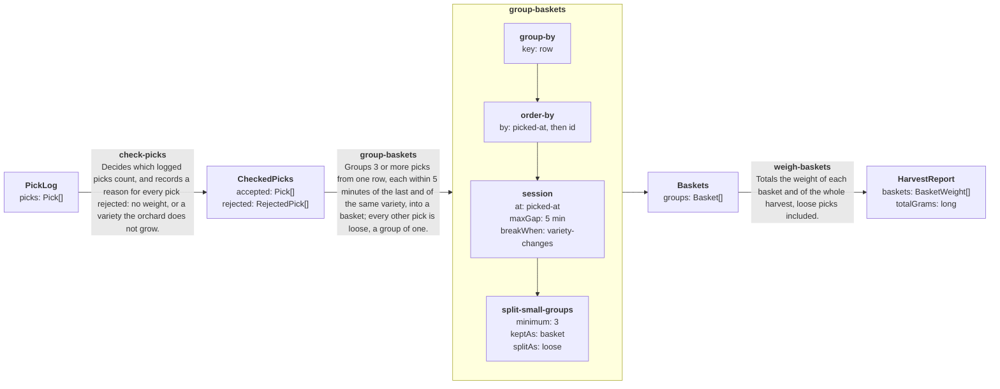

# harvest graph

Generated from `graph.manifest.json` by `seamlineage graph`. Do not edit.

Boxes are the data passed between stages; arrows are stages.

How to read the raw diagram text: a few lines only control the drawing and say nothing about the product. `flowchart LR` draws left to right; `subgraph … end` draws a box around a stage's steps; `direction TB` stacks the steps inside that box top to bottom; `a_1 --> a_2` is an arrow between two steps (the `_1`, `_2` names are internal labels).

## Stages

Each arrow above, with its page (how it decides, and what it decides on each example), the code that implements it and the examples that specify it.

| Stage | What it decides | Code | Examples |
|---|---|---|---|
| [**check-picks**](graph/check-picks.md) | Decides which logged picks count, and records a reason for every pick rejected: no weight, or a variety the orchard does not grow. | [CheckPicks.cs](src/Harvest/CheckPicks.cs) | [4 cases](fixtures/check-picks/) |
| [**group-baskets**](graph/group-baskets.md) | Groups 3 or more picks from one row, each within 5 minutes of the last and of the same variety, into a basket; every other pick is loose, a group of one. | [GroupBaskets.cs](src/Harvest/GroupBaskets.cs) | [5 cases](fixtures/group-baskets/) |
| [**weigh-baskets**](graph/weigh-baskets.md) | Totals the weight of each basket and of the whole harvest, loose picks included. | [WeighBaskets.cs](src/Harvest/WeighBaskets.cs) | [2 cases](fixtures/weigh-baskets/) |

## Judgments

The decisions a composed stage makes itself. Everything else in its box above is a generic operator, listed below.

| Stage | Judgment | Meaning |
|---|---|---|
| **group-baskets** | `row` | The row part of the tree id (row-3 of row-3/tree-12), so a basket never spans rows. |
| **group-baskets** | `picked-at` | When the fruit was picked by the picker's watch; none if it was not noted. |
| **group-baskets** | `id` | The pick's id, which keeps log order among picks noted at the same minute. |
| **group-baskets** | `variety-changes` | The pick is a different variety from the one before it, so a basket holds one variety. |

## Operators

Generic building blocks, product-agnostic and the same in every stage that uses them.

| Operator | What it does |
|---|---|
| **group-by** | Splits the items into groups that share a key, in the order each key first appears. |
| **order-by** | Sorts the items within each group by the keys in turn, keeping the original order for ties; an item with no value for a key sorts after those with one, and text compares ordinally. |
| **session** | Splits each ordered group into sessions: an item joins the current session when its time is at most maxGap after the time of the previous item and no breakWhen judgment holds; otherwise it starts a new one. An item with no time is a session of its own. |
| **split-small-groups** | Keeps each group of at least minimum items whole, labelled keptAs; splits each smaller group into groups of one item, each labelled splitAs. Groups stay in order, and the items of a split group stay in its place. |

## Other types

- **Basket**: key: string, kind: BasketKind, picks: Pick[]
- **BasketKind**: basket | loose
- **BasketWeight**: key: string, kind: BasketKind, picks: int, grams: long
- **Pick**: id: string, tree: string, variety: string, weightGrams: int, pickedAt: localdatetime?
- **RejectReason**: noWeight | unknownVariety
- **RejectedPick**: id: string, reason: RejectReason
