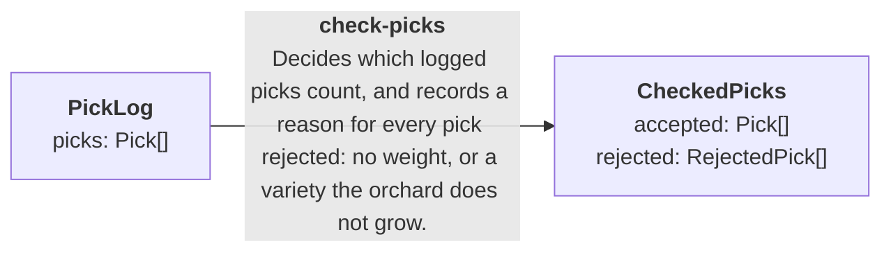

# check-picks

Generated from `graph.manifest.json` by `seamlineage graph`. Do not edit. Part of the [harvest graph](../GRAPH.md).

Decides which logged picks count, and records a reason for every pick rejected: no weight, or a variety the orchard does not grow.

| | |
|---|---|
| Input | `PickLog` |
| Output | `CheckedPicks` |
| Code | [CheckPicks.cs](../src/Harvest/CheckPicks.cs) |
| Examples | [4 cases](../fixtures/check-picks/) |

## Diagram

The stage's input and output (drawn as in GRAPH.md). A plain stage: one block of code.

## Examples

This stage declares no example view, so each case shows the top-level lists of its input.json and expected.json as tables, with nested values summarised.

### [keeps-weighed-picks-of-known-varieties](../fixtures/check-picks/keeps-weighed-picks-of-known-varieties/)

Input `picks`:

| id | tree | variety | weightGrams | pickedAt |
|---|---|---|---|---|
| p1 | row-1/tree-1 | gala | 180 | 2026-09-12T09:00:00 |
| p2 | row-1/tree-2 | cox | 150 | 2026-09-12T09:01:00 |

Expected `accepted`:

| id | tree | variety | weightGrams | pickedAt |
|---|---|---|---|---|
| p1 | row-1/tree-1 | gala | 180 | 2026-09-12T09:00:00 |
| p2 | row-1/tree-2 | cox | 150 | 2026-09-12T09:01:00 |

Expected `rejected`: none

### [no-weight-is-reported-before-an-unknown-variety](../fixtures/check-picks/no-weight-is-reported-before-an-unknown-variety/)

Input `picks`:

| id | tree | variety | weightGrams | pickedAt |
|---|---|---|---|---|
| p1 | row-2/tree-4 | pear | 0 | 2026-09-12T10:00:00 |

Expected `accepted`: none

Expected `rejected`:

| id | reason |
|---|---|
| p1 | noWeight |

### [rejects-a-pick-with-no-weight](../fixtures/check-picks/rejects-a-pick-with-no-weight/)

Input `picks`:

| id | tree | variety | weightGrams | pickedAt |
|---|---|---|---|---|
| p1 | row-1/tree-1 | gala | 0 | 2026-09-12T09:00:00 |
| p2 | row-1/tree-1 | gala | 170 | 2026-09-12T09:01:00 |

Expected `accepted`:

| id | tree | variety | weightGrams | pickedAt |
|---|---|---|---|---|
| p2 | row-1/tree-1 | gala | 170 | 2026-09-12T09:01:00 |

Expected `rejected`:

| id | reason |
|---|---|
| p1 | noWeight |

### [rejects-a-variety-the-orchard-does-not-grow](../fixtures/check-picks/rejects-a-variety-the-orchard-does-not-grow/)

Input `picks`:

| id | tree | variety | weightGrams | pickedAt |
|---|---|---|---|---|
| p1 | row-2/tree-4 | pear | 200 | 2026-09-12T10:00:00 |
| p2 | row-2/tree-5 | russet | 140 | null |

Expected `accepted`:

| id | tree | variety | weightGrams | pickedAt |
|---|---|---|---|---|
| p2 | row-2/tree-5 | russet | 140 | null |

Expected `rejected`:

| id | reason |
|---|---|
| p1 | unknownVariety |
