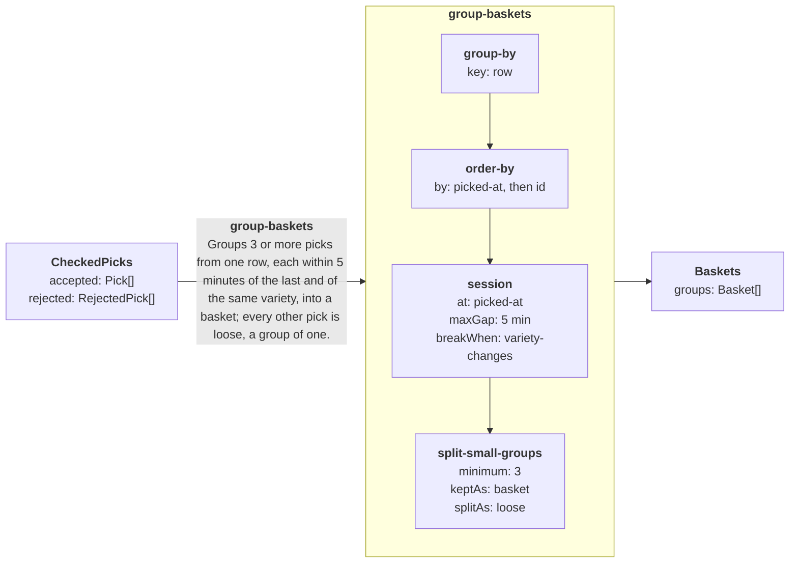

# group-baskets

Generated from `graph.manifest.json` by `seamlineage graph`. Do not edit. Part of the [harvest graph](../GRAPH.md).

Groups 3 or more picks from one row, each within 5 minutes of the last and of the same variety, into a basket; every other pick is loose, a group of one.

| | |
|---|---|
| Input | `CheckedPicks` |
| Output | `Baskets` |
| Code | [GroupBaskets.cs](../src/Harvest/GroupBaskets.cs) |
| Examples | [5 cases](../fixtures/group-baskets/) |

## Diagram

The stage's input and output, and its steps in order (drawn as in GRAPH.md).



## Pipeline

How the stage decides, one step per line, from its operators' phrases. The names in it are judgments, listed below.

```text
accepted picks
| group by row
| order each group by picked-at, then id
| start a new session when: more than 5 min since the previous picked-at, or variety-changes
| keep groups of 3 or more whole as basket; split the rest into groups of one, each loose
```

## Judgments

The decisions the stage makes itself; everything else in the pipeline is a generic operator.

| Judgment | Meaning |
|---|---|
| `row` | The row part of the tree id (row-3 of row-3/tree-12), so a basket never spans rows. |
| `picked-at` | When the fruit was picked by the picker's watch; none if it was not noted. |
| `id` | The pick's id, which keeps log order among picks noted at the same minute. |
| `variety-changes` | The pick is a different variety from the one before it, so a basket holds one variety. |

## Examples

What the stage decides on each example. Each row is one item of `accepted` in the case's input.json; columns marked → are its outcome, read from expected.json (– when no output holds it).

### [a-change-of-variety-starts-a-new-basket](../fixtures/group-baskets/a-change-of-variety-starts-a-new-basket/)

| pick | tree | variety | picked at | → basket | → kind |
|---|---|---|---|---|---|
| p1 | row-3/tree-1 | gala | 2026-09-12T11:00:00 | p1 | basket |
| p2 | row-3/tree-1 | gala | 2026-09-12T11:01:00 | p1 | basket |
| p3 | row-3/tree-2 | gala | 2026-09-12T11:02:00 | p1 | basket |
| p4 | row-3/tree-3 | bramley | 2026-09-12T11:03:00 | p4 | loose |
| p5 | row-3/tree-3 | bramley | 2026-09-12T11:04:00 | p5 | loose |

### [a-gap-over-five-minutes-starts-a-new-basket](../fixtures/group-baskets/a-gap-over-five-minutes-starts-a-new-basket/)

| pick | tree | variety | picked at | → basket | → kind |
|---|---|---|---|---|---|
| p1 | row-1/tree-1 | cox | 2026-09-12T09:00:00 | p1 | basket |
| p2 | row-1/tree-1 | cox | 2026-09-12T09:05:00 | p1 | basket |
| p3 | row-1/tree-2 | cox | 2026-09-12T09:10:00 | p1 | basket |
| p4 | row-1/tree-3 | cox | 2026-09-12T09:16:00 | p4 | loose |

### [a-pick-with-no-time-is-loose](../fixtures/group-baskets/a-pick-with-no-time-is-loose/)

| pick | tree | variety | picked at | → basket | → kind |
|---|---|---|---|---|---|
| p1 | row-4/tree-1 | gala | 2026-09-12T15:00:00 | p1 | basket |
| p2 | row-4/tree-1 | gala | null | p2 | loose |
| p3 | row-4/tree-2 | gala | 2026-09-12T15:01:00 | p1 | basket |
| p4 | row-4/tree-2 | gala | 2026-09-12T15:02:00 | p1 | basket |

### [rows-never-share-a-basket](../fixtures/group-baskets/rows-never-share-a-basket/)

| pick | tree | variety | picked at | → basket | → kind |
|---|---|---|---|---|---|
| p1 | row-1/tree-1 | russet | 2026-09-12T14:00:00 | p1 | basket |
| p2 | row-2/tree-1 | russet | 2026-09-12T14:01:00 | p2 | loose |
| p3 | row-1/tree-2 | russet | 2026-09-12T14:02:00 | p1 | basket |
| p4 | row-2/tree-2 | russet | 2026-09-12T14:03:00 | p4 | loose |
| p5 | row-1/tree-3 | russet | 2026-09-12T14:04:00 | p1 | basket |

### [three-close-picks-in-a-row-are-a-basket](../fixtures/group-baskets/three-close-picks-in-a-row-are-a-basket/)

| pick | tree | variety | picked at | → basket | → kind |
|---|---|---|---|---|---|
| p1 | row-1/tree-1 | gala | 2026-09-12T09:00:00 | p1 | basket |
| p2 | row-1/tree-2 | gala | 2026-09-12T09:02:00 | p1 | basket |
| p3 | row-1/tree-2 | gala | 2026-09-12T09:05:00 | p1 | basket |
