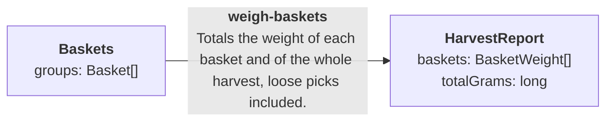

# weigh-baskets

Generated from `graph.manifest.json` by `seamlineage graph`. Do not edit. Part of the [harvest graph](../GRAPH.md).

Totals the weight of each basket and of the whole harvest, loose picks included.

| | |
|---|---|
| Input | `Baskets` |
| Output | `HarvestReport` |
| Code | [WeighBaskets.cs](../src/Harvest/WeighBaskets.cs) |
| Examples | [2 cases](../fixtures/weigh-baskets/) |

## Diagram

The stage's input and output (drawn as in GRAPH.md). A plain stage: one block of code.

## Examples

This stage declares no example view, so each case shows the top-level lists of its input.json and expected.json as tables, with nested values summarised.

### [an-empty-harvest-weighs-nothing](../fixtures/weigh-baskets/an-empty-harvest-weighs-nothing/)

Input `groups`: none

Expected `baskets`: none

Expected `totalGrams`: 0

### [totals-each-basket-and-the-harvest](../fixtures/weigh-baskets/totals-each-basket-and-the-harvest/)

Input `groups`:

| key | kind | picks |
|---|---|---|
| p1 | basket | 3 items |
| p4 | loose | 1 item |

Expected `baskets`:

| key | kind | picks | grams |
|---|---|---|---|
| p1 | basket | 3 | 500 |
| p4 | loose | 1 | 200 |

Expected `totalGrams`: 700
